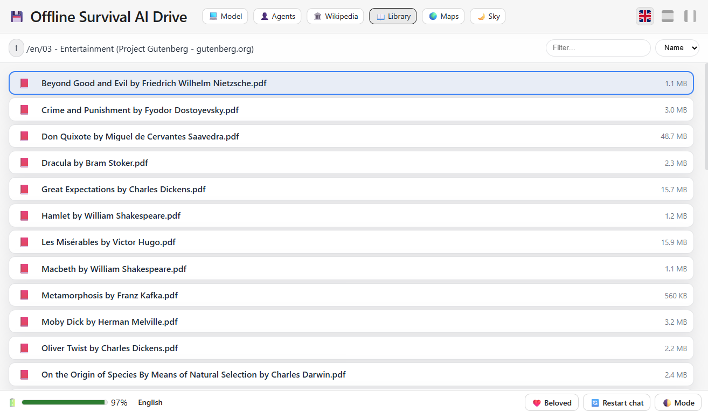
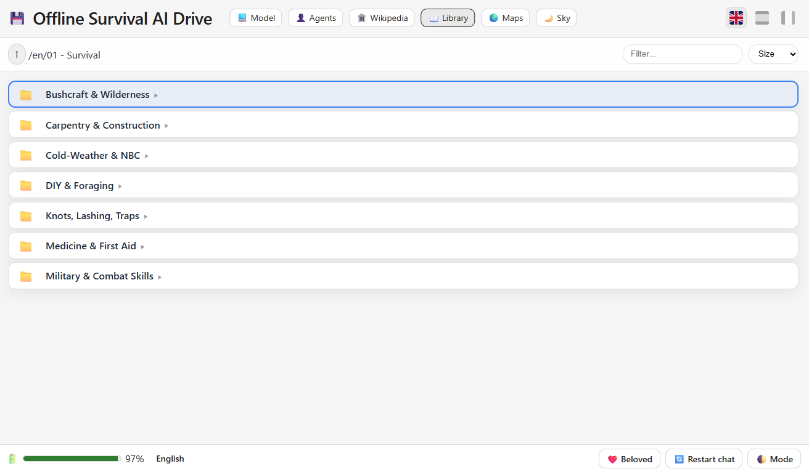
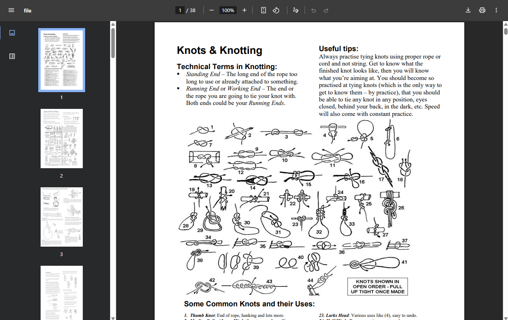

# 💾 Offline Survival AI Drive
### 🔹 Offline LLM & Agents & Wikipedia & Maps & Documents (EN,ES,FR)

<p align="center">
  
</p>

**Survival AI** is a 100% **offline** desktop-style web app to chat with a **local LLM (GGUF)** or with **expert agents** (medical, biology, engineering, etc.). It also integrates **offline Wikipedia, Offline Maps and Survival Documentation**.
**No internet required.**

- AI model (Miscrosoft): **Phi-3 Mini 4K Instruct (Q4_K_M)**
- Maps: **Protomaps OpenStreetMaps** (planet.pmtiles)  
- Wikipedia: **kiwix-serve** with local **ZIM** files

<p align="center">
  
</p>

### ✨ Features

- **100% offline**: runs locally with GGUF models via `llama-cpp-python` (no cloud, no telemetry).
- **Two chat modes**: **🤖 Model** — direct chat with the selected LLM. **👥 Agents** — visual agent picker (medical, engineering, etc.).
- **Offline Worldwide Map**: built-in tab that works with **Protomaps and pmtiles** + **OpenStreetMaps** files.
- **Offline Wikipedia**: built-in tab that works with **Kiwix** + **ZIM** files; can auto-start `kiwix-serve`.
- **3 types of wikipedia available**: "maxi", "no-pic" & "mini".
- **Library Folders**: for **.pdf** files you want to store.
- **Multi-language UI**: EN / ES / FR (including localized agent categories).
- **Clean UI/UX**: light/dark theme toggle, battery indicator bar.
 
> This repository **does not ship any model or ZIM files or pmtiles files**. You’ll download them yourself (links and instructions provided below) or download the portable app with the files from our website.


---

# ✅ Requirements

This project is designed to run **fully offline** on a modest CPU-only machine. Below are the **technical requirements** for your workstation.

### Hardware (recommended)
- **CPU:** x86_64 with **AVX2** support (for good `llama-cpp-python` performance).
- **RAM:** 8 GB minimum (16 GB recommended for smoother multitasking or larger contexts).
- **Disk:** from 8 to 200 GB depending on the **GGUF** model(s) you keep plus **Wikipedia ZIM** files and **pmtiles** files.
- **GPU:** *Not required* (CPU-only).

### Operating Systems
- **Windows 10/11 x64**
- **macOS** (coming soon)
- **Linux** (coming soon)


---

# 📝 Instructions

The following instructions are intended for the Portable windows x64 version you can find in our website **https://offlineai.org** or in the following link: [Download Link](https://offlineai.org)

## 📦 Project Structure for needed files
Download the project zip file and extract in root **C:/**

```
/SurvivalAI
│
├── SurvivalAI.exe
│
├── backend/
│ ├── main.py
│ ├── requirements.txt
│
├── docs/
│ ├── en/organize .pdf as you want.
│ ├── es/organize .pdf as you want.
│ └── fr/organize .pdf as you want.
│
│
├── frontend/
│ ├── index.html
│ ├── style.css
│ └── script.js
│
├── models/ # Put your .gguf files here (e.g., Phi-3-mini-4k-instruct.Q4_K_M.gguf)
│
├── kiwix/
│ ├── kiwix-serve(.exe)
│ └── content/ # Put Wikipedia .zim files here (ES/EN/FR; maxi/nopic/mini)
│
├── agents.json
├── categories.json
├── supporters.json
├── README.md
└── LICENSE
```


---

# 🤖 Downloading the Model (Phi-4 Mini Instruct Q4_K_M, GGUF)

**Licensing & responsibility**

- The file below is hosted by a third-party Hugging Face repo. You are responsible for ensuring the **license is compatible** with your intended use and for keeping any required **attributions**.

**Download page:**  
https://huggingface.co/matrixportalx/Phi-4-mini-instruct-Q4_K_M-GGUF

**Download model link (.GGUF file - 2,49 GB):**  
https://huggingface.co/matrixportalx/Phi-4-mini-instruct-Q4_K_M-GGUF/blob/main/phi-4-mini-instruct-q4_k_m.gguf

> Place the GGUF file in: ``./SurvivalAI/_internal/models/phi-4-mini-instruct-q4_k_m.gguf`` (do **not** rename unless you also update `MODEL_FILE` in the backend and `MODELS` in the frontend).


---

# 📖 Downloading Wikipedia ZIM files for Kiwix

Your app looks for **exact filenames** and picks the first available in this priority: **maxi → nopic → mini**.  
👉 **Do not rename** the files after download. Put them under: `./SurvivalAI/_internal/kiwix/content/file_name.zim`

<p align="center">
  
</p>

**Download page (browse & pick):**  
https://download.kiwix.org/zim/wikipedia/

### 🌐 Target filenames.
(candidates your backend expects, select toe option you prefer)

**Zim File Types**.

**all_maxi** --> All articles - Full Articles with Images.
**all_nopic** --> All articles - Full Articles without Images.
**all_mini** --> All articles - First section Articles without Images. 


**EN:**
  - [wikipedia_en_all_maxi_2025-08.zim](https://download.kiwix.org/zim/wikipedia/wikipedia_en_all_maxi_2025-08.zim) - (116 GB)
  - [wikipedia_en_all_nopic_2025-08.zim](https://download.kiwix.org/zim/wikipedia/wikipedia_en_all_nopic_2025-08.zim) - (43 GB)
  - [wikipedia_en_all_mini_2025-06.zim](https://download.kiwix.org/zim/wikipedia/wikipedia_en_all_mini_2025-06.zim) - (14 GB)

**ES (2.052.431 articles):**
  - [wikipedia_es_all_maxi_2025-07.zim](https://download.kiwix.org/zim/wikipedia/wikipedia_es_all_maxi_2025-07.zim) - (38 GB)
  - [wikipedia_es_all_nopic_2025-08.zim](https://download.kiwix.org/zim/wikipedia/wikipedia_es_all_nopic_2025-08.zim) - (9 GB)
  - [wikipedia_es_all_mini_2025-08.zim](https://download.kiwix.org/zim/wikipedia/wikipedia_es_all_mini_2025-08.zim) - (3 GB)

**FR:**
  - [wikipedia_fr_all_maxi_2025-06.zim](https://download.kiwix.org/zim/wikipedia/wikipedia_fr_all_maxi_2025-06.zim) - (54 GB)
  - [wikipedia_fr_all_nopic_2025-08.zim](https://download.kiwix.org/zim/wikipedia/wikipedia_fr_all_nopic_2025-08.zim) - (11 GB)
  - [wikipedia_fr_all_mini_2025-08.zim](https://download.kiwix.org/zim/wikipedia/wikipedia_fr_all_mini_2025-08.zim) - (4 GB)

👉 **Do not rename** the files after download. Put them under: `./SurvivalAI/_internal/kiwix/content/file_name.zim`

---

# 🌍 Downloading the Worldwide Map (planet.pmtiles)

**Worldwide Maps**

- Download instructions.

<p align="center">
  
</p>

**Download page:**  
https://maps.protomaps.com/builds/

👉 Place the **planet.pmtiles** file in: `./SurvivalAI/_internal/frontend/assets/maps/planet.pmtiles` (**Rename it** to planet.pmtiles if needed).


---

# 📚 Adding more books to the library (pdf files)

**Description**

- Always **read and comply** with the model card/license on the download page before using the model (including any **commercial-use** restrictions).
- The file below is hosted by a third-party Hugging Face repo. You are responsible for ensuring the **license is compatible** with your intended use and for keeping any required **attributions**.

<p align="center">
  
</p>
<p align="center">
  
</p>
<p align="center">
  
</p>

**Project Gutemberg Resource:**  
https://www.gutenberg.org/

👉 Place the **.pdf** file in: `./SurvivalAI/_internal/docs/and the folders you want inside` (**Rename it** to planet.pmtiles if needed).


---
