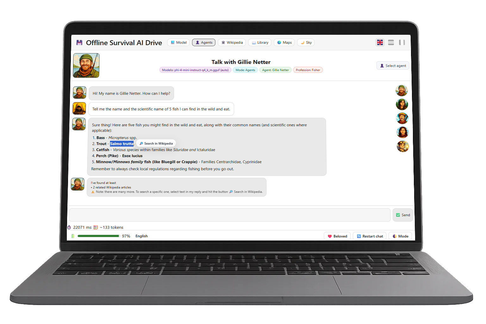

<h1 align="center">
  
  Offlined.org
</h1>
<br>
<p align="center">
  
</p>
<br>
<p align="center">
  <a href="https://github.com/Aruvaro-Chulvi/Offlined/releases/latest">
    
  </a>
  <br>
  <a href="https://github.com/Aruvaro-Chulvi/Offlined/issues">
    
  </a>
  <br>
  <a href="https://github.com/Aruvaro-Chulvi/Offlined/blob/main/LICENSE.md">
    
  </a>
</p>

<br>

<p align="center">
  <b>🎥 Walkthrough & Installation Guide</b><br><br>
  <a href="https://www.youtube.com/watch?v=KHSs10jwwG8" target="_blank">
    
  </a>
  <br><br>
  ▶️ <b>Click to watch on YouTube</b>
</p>

<br>

### 🔹 OFFLINED V4.0 (EN, ES, FR, PT)

**OFFLINED** is a fully self-contained, 100% offline, desktop-style web application designed to provide users with an autonomous digital knowledge environment without relying on the internet. It allows interaction with a local Large Language Model (gpt-oss-20b-Q4_K_M, GGUF format) as well as with specialized knowledge agents spanning domains such as medicine, biology, engineering, survival, and other fields — all running entirely on the user’s own device.

OFFLINED is more than a chat interface. It integrates a complete offline knowledge and productivity ecosystem, including **offline Wikipedia**, **offline worldwide maps** with search, favorites, and markers, a **taxonomic Wiki-Trees explorer**, a **local media center** (images, music, videos, documents), **file management with folders and drag-and-drop**, **notes and audio notes**, **calendar**, **whiteboard**, and a personal document library.<br><br>In addition to the integrated applications, any portable application can be installed and included.  
<br>All components operate locally, without cloud services, telemetry, analytics, or external network calls.

OFFLINED is designed as a personal offline “operating system” for knowledge, study, preparedness, and digital independence. Whether used as a private local AI assistant, a portable encyclopedia, or a resilient information toolkit for low-connectivity or emergency scenarios, OFFLINED continues to function anywhere — even in total isolation.  
The system is lightweight, privacy-first, multilingual, and deliberately self-sufficient.

When internet access is unavailable, **your AI, your data, and your knowledge remain with you.**


<br>
<p align="center">
  
</p>

### ✨ Features

- **100% offline by design**: Runs entirely locally using GGUF models via `llama-cpp-python`. No cloud services, telemetry, analytics, or external network calls.
- **Local AI chat**:  
  - **🤖 Model mode** — direct interaction with the selected local LLM.  
  - **👥 Agents mode** — a visual agent selector providing domain-focused knowledge agents (e.g. medicine, engineering, survival, education).
- **Contextual Wikipedia lookup**: Select text from LLM responses to instantly search related offline Wikipedia articles.
- **Offline worldwide maps**: Integrated map view powered by **Protomaps**, **PMTiles**, and **OpenStreetMap** data, with search, markers, and favorites.
- **Offline Wikipedia integration**: Built-in Wikipedia viewer using **Kiwix** and **ZIM** files, with optional automatic startup of `kiwix-serve`.
- **Wiki-Trees explorer**: A structured, taxonomic interface for guided and intuitive exploration of Wikipedia content.
- **Multiple Wikipedia datasets supported**:  
  - *Maxi* (full articles with images)  
  - *No-pic* (full articles without images)  
  - *Mini* (intro sections only)
- **Local document library**: Folder-based management of **PDF documents** with drag-and-drop organization.
- **Media library**: Local browsing and playback of images, audio, video, and documents.
- **Built-in productivity tools**:  
  - Notes and audio notes  
  - Calendar  
  - Whiteboard / drawing workspace  
  - Portable apps compatible
- **Multi-language user interface**: English, Spanish, French, and Portuguese, including localized agent categories.
- **Clean and informative UI**: Light and dark themes, system indicators for battery, disk usage, CPU, RAM, and temperature.

 
> This portable zip file **does not ship any model or ZIM files or pmtiles files**. You’ll download them yourself (links and instructions provided below). 
<br>

<p align="center">
⚠️ The following instructions are intended for the windows x64 portable version provided below.<br>🔥 If you want to have a look, project files are included in the source code.<br>👥 This is our first GitHub project, and we would love to find collaborators who believe that sharing this with the world is valuable enough to dedicate time and effort to.
</p>
<br>

---

# 📑 Index

- [✅ Requirements](#-requirements)
- [🌍 Who is it for?](#-who-is-offlined-for)
- [📝 Instructions](#-instructions)
- [📖 Downloading Wikipedia ZIM files](#-downloading-wikipedia-zim-files)
- [📚 Adding more to your library (pdf files)](#-adding-more-to-your-library-pdf-files)
- [🌍 Downloading the planet.pmtiles file](#-downloading-the-planetpmtiles-file)
- [🙋 FAQ](#-faq)
- [🔮 Future Versions](#-future-versions)
  - [🧭 Roadmap](#-roadmap)
- [⚖️ License & Usage Summary](#%EF%B8%8F-license--usage-summary) 
- [🤝 Feedback & Support](#-feedback--support)
- [📜 Licenses](#-licenses)
- [❤️ Special thanks](#%EF%B8%8F-special-thanks)

<br>

---

# ✅ Requirements

This project is designed to run **fully offline** on a modest CPU-only machine. Below are the **technical requirements** for your workstation.

### Hardware (recommended)
- **CPU:** x86_64 with **AVX2** support (for good `llama-cpp-python` performance).
- **RAM:** 8 GB minimum (16 GB recommended for smoother multitasking or larger contexts).
- **Disk:** from 8 to 200 GB depending on the **GGUF** model(s) you keep plus **Wikipedia ZIM** files and **pmtiles** files.
- **GPU:** *Not required* (CPU-only).

### Operating Systems
- **Windows 10/11 x64**
- **macOS** (coming soon)
- **Linux** (coming soon)

### Storage
- **You can run it from a folder on your PC’s drive, from an external hard drive, or even from a USB stick.**
<br><br>

---

## 🌍 Who is OFFLINED for?

**OFFLINED** is designed for individuals and organizations that require reliable access to knowledge and tools without depending on continuous internet connectivity, including:

- **Preparedness and outdoor communities** seeking dependable offline information and tools.
- **Schools, libraries, and educational programs** in low-connectivity or high-cost connectivity regions.
- **NGOs and emergency response teams** operating in field, disaster, or infrastructure-limited environments.
- **Researchers, archivists, and educators** who value self-hosted, long-term access to reference material.
- **Privacy-conscious users** who prefer fully local computation, storage, and control over their data.

While these groups represent the core use cases today, OFFLINED is also relevant to anyone who values **resilient access to knowledge**, **digital autonomy**, and **offline-first workflows** in an increasingly cloud-dependent world.

<br><br>

---

# 📝 Instructions

The following instructions are intended for the **Portable windows x64 version** you can find in our website **https://www.offlined.org** or in the following link: [Download Link](https://mega.nz/file/lJ0nGZTZ#uWp51wdfAdMSr3pV2vgWPlZI4e97ObJOQxwvfB1IIZ4)

## 📦 Project Structure for needed files
Download the project zip file and extract in root **C:/** or in the **folder** you prefer on your desktop.

```
/Offlined
├── Offlined.exe
│
├── _internal/
│  │
│  ├── backend/
│  │ ├── main.py
│  │ ├── requirements.txt
│  │
│  ├── docs/
│  │ ├── en/ organize English PDF Files as you like.
│  │ ├── es/ organize Spanish PDF Files as you like.
│  │ └── fr/ organize French PDF Files as you like.
│  │
│  │
│  ├── frontend/
│  │ ├── index.html
│  │ ├── style.css
│  │ ├── script.js
|  | └── assets/
|  |     └── maps/ # Put your .pmtiles files here (planet.pmtiles)
│  │
│  ├── models/ # Put your .gguf files here (e.g., gpt-oss-20b-Q4_K_S.gguf)
│  │
│  ├── kiwix/
│  │ ├── kiwix-serve(.exe)
│  │ └── content/ # Put Wikipedia .zim files here (ES/EN/FR; maxi/nopic/mini)
│  │
│  ├── agents.json
│  ├── categories.json
│  ├── supporters.json
│  ├── README.md
│  └── LICENSE
```

<br><br>

---

# 📖 Downloading Wikipedia ZIM files

<p align="center">
  
</p>

**Download page (browse & pick, choose this link if you want to see all available zim files and download selecting the preferred one, or use the below links):**  
https://download.kiwix.org/zim/wikipedia/

### 📄 Target filenames.
(filenames your backend expects; select the option you prefer)

**Zim File Types**.<br>
**Which file do I need to select? the one you prefer**😉.

- **all_maxi** — Full articles with images  
- **all_nopic** — Full articles without images  
- **all_mini** — First section only, no images


⚠️⚠️⚠️ Be careful before downloading large files to your computer. ⚠️⚠️⚠️

**EN (7.042.731 articles):**
  - [wikipedia_en_all_maxi_2025-08.zim](https://download.kiwix.org/zim/wikipedia/wikipedia_en_all_maxi_2025-08.zim) - (116 GB)
  - [wikipedia_en_all_nopic_2025-08.zim](https://download.kiwix.org/zim/wikipedia/wikipedia_en_all_nopic_2025-08.zim) - (43 GB)
  - [wikipedia_en_all_mini_2025-06.zim](https://download.kiwix.org/zim/wikipedia/wikipedia_en_all_mini_2025-06.zim) - (14 GB)

**ES (2.052.431 articles):**
  - [wikipedia_es_all_maxi_2025-07.zim](https://download.kiwix.org/zim/wikipedia/wikipedia_es_all_maxi_2025-07.zim) - (38 GB)
  - [wikipedia_es_all_nopic_2025-08.zim](https://download.kiwix.org/zim/wikipedia/wikipedia_es_all_nopic_2025-08.zim) - (9 GB)
  - [wikipedia_es_all_mini_2025-08.zim](https://download.kiwix.org/zim/wikipedia/wikipedia_es_all_mini_2025-08.zim) - (3 GB)

**FR (2.693.000 articles):**
  - [wikipedia_fr_all_maxi_2025-06.zim](https://download.kiwix.org/zim/wikipedia/wikipedia_fr_all_maxi_2025-06.zim) - (54 GB)
  - [wikipedia_fr_all_nopic_2025-08.zim](https://download.kiwix.org/zim/wikipedia/wikipedia_fr_all_nopic_2025-08.zim) - (11 GB)
  - [wikipedia_fr_all_mini_2025-08.zim](https://download.kiwix.org/zim/wikipedia/wikipedia_fr_all_mini_2025-08.zim) - (4 GB)

**PT (1.160.442 articles):**
  - [wikipedia_pt_all_maxi_2025-09.zim](https://download.kiwix.org/zim/wikipedia/wikipedia_pt_all_maxi_2025-09.zim) - (17 GB)
  - [wikipedia_pt_all_nopic_2025-11.zim](https://download.kiwix.org/zim/wikipedia/wikipedia_pt_all_nopic_2025-11.zim) - (5 GB)
  - [wikipedia_pt_all_mini_2025-11.zim](https://download.kiwix.org/zim/wikipedia/wikipedia_pt_all_mini_2025-11.zim) - (2 GB)

👉 **Do not rename** the files after download. Put them under: `./Offlined/_internal/kiwix/content/file_name.zim`

<br><br>

---

# 📚 Downloading the library (pdf files)

**Adding more files to your library:**  
**Our Recommendation - Project Gutenberg Resource:** is a volunteer-driven digital library that offers over 70,000 free eBooks, including many classics of world literature. All the books are in the public domain, which means they can be freely read, downloaded, and shared without cost. It is one of the oldest and largest online collections of free books, created to make cultural works accessible to everyone, everywhere.
https://www.gutenberg.org/

Remember to transform to .pdf files till more formats available. <br>
👉 Place your **.pdf** files in:<br> `./Offlined/_internal/docs/` and the folders you want inside <br> **Organize as you wish 🤪**.<br><br>

<p align="center">
  
</p>

**You can also add your own audio and video files to the library on the "music" and "video" folders.** 


👉 Place your **.mp3**, **.avi**, **.mp4** files in: `./Offlined/_internal/media/` and use the **music** folder for your audio files and the **video** folder for video files. <br> **Organize as you wish 🤪**.<br><br>
<br><br>

---

# 🌍 Downloading the planet.pmtiles file

**Worldwide Maps**

- Download instructions.

<p align="center">
  
</p>

**Download page:**  
https://maps.protomaps.com/builds/

⚠️⚠️⚠️ Be careful before downloading large files to your computer. ⚠️⚠️⚠️

[**Download planet.pmtiles full layer link (.pmtiles file - 120 GB):**](https://demo-bucket.protomaps.com/v4.pmtiles)  

👉 Rename and place **planet.pmtiles** file in: `./Offlined/_internal/frontend/assets/maps/planet.pmtiles` **Rename it** to planet.pmtiles, no matter which version you choose, rename always to **planet.pmtiles**.

### 🔐 Local privacy & security
- `kiwix-serve` is launched **bound to `127.0.0.1`** (localhost) only.  
- The app does **not** make external network requests after installation.  
- You can air-gap the device; OFFLINED continues to work fully offline.


<br><br>

---


## 🙋 FAQ

### Q1. Do I need an internet connection to use OFFLINED?
No. All core components run locally, including the LLM, knowledge agents, maps, Wikipedia, and your document library.  
An internet connection is only required initially to download models, Wikipedia ZIM files, or map data (PMTiles).

---

### Q2. Can I use OFFLINED in portable mode (no installation)?
Yes. OFFLINED is fully portable.  
Simply launch the `.exe` file — the application can run from a local folder, an external drive, or a USB stick.

---

### Q3. Do my data ever leave my computer, external drive, or USB stick?
No. OFFLINED does not transmit user data externally.  
There is no cloud backend, telemetry, analytics, or third-party API usage.  
All processing and storage occur locally on your device.

---

### Q4. Does OFFLINED send my chats to Microsoft, Google, OpenAI, or any other company?
No.  
All inference and data handling occur locally. Conversations are not transmitted to external services.

---

### Q5. How much disk space does OFFLINED require?
Disk usage depends on the components you choose to install:

- Base application → ~200–250 MB  
- One GGUF model → ~12 GB  
- Wikipedia Maxi ZIM files (language-dependent) → ~40–120 GB  
- Global maps (`planet.pmtiles`) → ~120 GB  
- Personal documents and media → user-defined  

You control the size of your offline environment.

---

### Q6. Does the app use CPU resources when idle?
When the language model is not actively processing a request, CPU usage is minimal.  
Resource usage increases only during active inference or media processing.

---

### Q7. How much RAM does OFFLINED need?
The default model, **Phi-4 Mini (Q4_K_M)**, typically runs smoothly with **4–6 GB of available RAM**.  
Larger or higher-precision GGUF models benefit from additional memory.  
The application itself is lightweight; memory demand is driven primarily by the selected model.

---

### Q8. Is offline Wikipedia required?
No. Wikipedia support is optional, but recommended.  
Any supported ZIM dataset (*maxi*, *nopic*, or *mini*) can be placed under:  
`./Offlined/_internal/kiwix/content/`  
To reduce disk usage, starting with the *mini* version is advised.

---

### Q9. Does OFFLINED work on Linux or macOS?
Windows x64 is the primary supported platform today.  
macOS and Linux support are planned and tracked in the project roadmap.

---

### Q10. Can I use my own GGUF models?
Not yet.  
Support for a model manager that detects and allows selection of custom `.gguf` files from `_internal/models/` is planned for a future release.

---

### Q11. How do I add my own PDF documents?
Place your PDF files in:  
`./Offlined/_internal/docs/`  
You may organize them into any folder structure you prefer. Files will appear automatically in the Library view.

---

### Q12. How do I migrate my data to a new version?
User data is stored in:
- `/Offlined/_internal/docs`  
- `/Offlined/_internal/media`  

Copying these folders into a newer OFFLINED version will preserve your documents and media.

---

### Q13. What happens if I delete a file from the Library?
In version **3.0**, deletion is immediate and permanent, with no recovery mechanism.  
A recycle bin feature is planned for **Offlined v4.0** to allow recovery of accidentally deleted files.

<br><br>

---

# 🔮 Future Versions

## 🧭 Roadmap

- [x] v1 — 💬 Chat Core - Base app (LLM Chat UI)  
- [x] v2 — 🏛️ Wikipedia integration + Text selection search  
- [x] v3 — 🗺️ Documentation & Offline Maps integration & Wiki-trees  
- [x] v4 — 📚 Integrated & Portable apps + switch from phi-4 to gpt-oss  
- [ ] v5 — 🌎 Adding more languages (German, Italian, Chinese, Korean, Japanese, arabic, russian)  
- [ ] v6 — 🤖 Under discussion

---

OFFLINED evolves through incremental, self-contained milestones.
Each version extends offline capability while preserving reliability, privacy, and local control.

### Completed

**v1 — 💬 Chat Core**  
Base application with local LLM chat and offline-first architecture.

**v2 — 🏛️ Wikipedia Integration**  
Offline Wikipedia access with contextual search from LLM responses.

**v3 — 🧱 Base Platform (Offline Knowledge OS)**  
Shipped the complete offline platform, including:

- Local LLM chat + Agents mode  
- Offline Wikipedia (Kiwix + ZIM) + contextual lookup from AI responses  
- Offline maps (MapLibre + PMTiles) with search, markers, and favorites  
- Offline sky visualization  
- Wiki-Trees explorer  
- Local documents & media library with drag-and-drop  

From this stage onward, OFFLINED is the base platform for offline knowledge, tools, and personal content.

**v4 — 📚 Integrated & Portable apps + switch from phi-4 to gpt-oss**  
- Built-in tools: notes, audio notes, calendar, whiteboard.  
- Portable apps support: Notepad++, PortableApps.com platform, and any other Windows-compatible portable application.

---

### In Progress / Planned

**v5 — 🌎 Adding more languages**  
Expanded language compatibility with the new model to:  
English, Spanish, French, Portuguese, German, Italian, Chinese, Korean, Japanese, Arabic, Russian.

---

### Long-term Vision (Exploratory)

The long-term goal of OFFLINED is to evolve into a portable, sovereign, offline personal AI assistant capable of reasoning over a user’s private knowledge base — including documents, references, and structured content — without cloud dependencies.

This assistant-centric core may be delivered through different forms as the platform evolves:

**v6 — 🤖 OFFLINED Personal Assistant Drive**  
We are currently looking for collaborators and actively discussing how to scale this project.

---

> As local language models continue to improve, OFFLINED is designed to adapt its agent and knowledge systems to benefit from stronger on-device reasoning — without introducing cloud dependencies.


<br><br>

---
# ⚖️ License & Usage Summary

**OFFLINED** is *source-available* software and is **not open-source** under OSI definitions.  
This licensing model is intentional: it provides transparency and user trust while preserving safety, coherence, and long-term sustainability.

- **Software (code):**  
  Free to use for **personal and educational purposes**.  
  **Commercial use, modification, or redistribution** require **prior written permission** from the authors.  
  The source code is provided for **transparency and personal study**, not for unrestricted reuse.  
  See [`LICENSE.md`](./LICENSE.md) for full terms.

- **Assets (avatars, agent texts, creative content):**  
  Licensed under **Creative Commons CC BY-NC-ND 4.0**.  
  Assets may be shared **unaltered**, with attribution.  
  **Commercial use and derivative works are not permitted**.  
  See [`LICENSE-ASSETS.md`](./LICENSE-ASSETS.md) for details.

For commercial licensing, partnerships, or redistribution rights, please contact the authors.


<br><br>

---
# 🤝 Feedback & Support

We welcome **issues** for bug reports, ideas, and translations (EN/ES/FR).  
Because OFFLINED is **source-available and non-commercial**, **pull requests are not accepted** unless you obtain **written approval** from the maintainers **before** submitting.

- Open an [Issue](../../issues) to:
  - Report a bug (include steps, logs, and OS).
  - Suggest a feature or UI copy improvement.
  - Propose translation fixes (EN/ES/FR).
- If you wish to contribute code, please **contact the maintainers first** for written approval.

### Sustainability
If you find OFFLINED valuable:
- ☕ Buy Me a Coffee: [offlined](https://buymeacoffee.com/offlined)
<br><br>

---


| Component            | License                                                                            |
|----------------------|------------------------------------------------------------------------------------|
| **Application code** | Custom source-available, non-commercial license (see [`LICENSE.md`](./LICENSE.md)) |
| **Avatars & bios**   | CC BY-NC-ND 4.0 (see [`LICENSE-ASSETS.md`](./LICENSE-ASSETS.md))                   |
| **Third-party code** | Licensed under their respective licenses (see `/licenses`)                         |

<br><br>

---

© 2026 Offlined Project — Created by Álvaro Cuadrado Chulvi & Eric Uguet.  
All rights reserved. Source-available for personal and educational use only.  
“Offlined” is a trademark of the Offlined Project.
