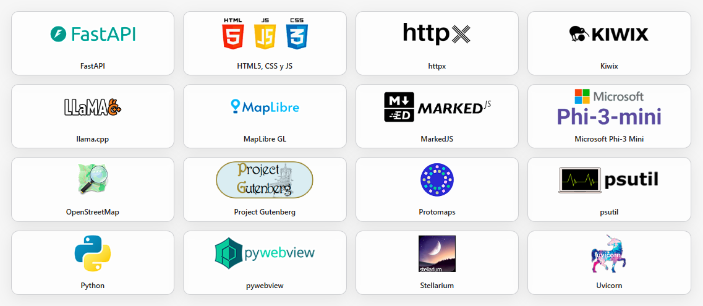

# 💾 Offline Survival AI Drive

<p align="center">
  <a href="https://github.com/Aruvaro-Chulvi/SurvivalAI/releases">
    
  </a>
  <a href="https://www.python.org/">
    
  </a>
  <a href="https://github.com/Aruvaro-Chulvi/SurvivalAI/releases/latest">
    
  </a>
  <a href="https://github.com/Aruvaro-Chulvi/SurvivalAI/stargazers">
    
  </a>
  <br>
  <a href="https://github.com/Aruvaro-Chulvi/SurvivalAI/issues">
    
  </a>
  <br>
  <a href="https://github.com/Aruvaro-Chulvi/SurvivalAI/blob/main/LICENSE.md">
    
  </a>
</p>


<p align="center">
⚠️ The following instructions are intended for the windows x64 portable version provided below.<br>🔥 If you want to have a look, project files are included in the github repository.<br>👥 This is our first github project, and all the help (and comprehension) would be appreciated.
</p><br>
<p align="center">
  
</p>

### 🔹 Offline LLM & Agents & Wikipedia & Maps & Documents (EN,ES,FR)

**Survival AI** is a 100% **offline** desktop-style web app to chat with a **local LLM (GGUF)** or with **expert agents** (medical, biology, engineering, etc.). It also integrates **offline Wikipedia, Offline Maps and Survival Documentation**.
**No internet required.**

- AI model (Miscrosoft): **Phi-4 Mini 4K Instruct (Q4_K_M)**
- Maps: **Protomaps OpenStreetMaps** (planet.pmtiles)  
- Wikipedia: **kiwix-serve** with local **ZIM** files
<br>
<p align="center">
  
</p>

### ✨ Features

- **100% offline**: runs locally with GGUF models via `llama-cpp-python` (no cloud, no telemetry).
- **Two chat modes**: **🤖 Model** — direct chat with the selected LLM. **👥 Agents** — visual agent picker (medical, engineering, etc.).
- **llm answer selecting**: Select text in llm answers for **wiki search feature**.
- **Offline Worldwide Map**: built-in tab that works with **Protomaps and pmtiles** + **OpenStreetMaps** files.
- **Offline Wikipedia**: built-in tab that works with **Kiwix** + **ZIM** files; can auto-start `kiwix-serve`.
- **3 types of wikipedia available**: "maxi", "no-pic" & "mini".
- **Library Folders**: for **.pdf** files you want to store.
- **Multi-language UI**: EN / ES / FR (including localized agent categories).
- **Clean UI/UX**: light/dark theme toggle, battery indicator bar.
 
> This portable zip file **does not ship any model or ZIM files or pmtiles files**. You’ll download them yourself (links and instructions provided below). **.doc files are incuded**, but you can add as more documents (.pdf format) as you want.

<br>

---

# 📑 Index

- [✅ Requirements](#-requirements)
- [🌍 Who is it for?](#-who-is-it-for)
- [📝 Instructions](#-instructions)
- [🤖 Downloading the Model (Phi-4 Mini.GGUF)](#-downloading-the-model-phi-4-minigguf)
- [📖 Downloading Wikipedia ZIM files](#-downloading-wikipedia-zim-files)
- [📚 Adding more to your library (pdf files)](#-adding-more-to-your-library-pdf-files)
- [🌍 Downloading the planet.pmtiles file](#-downloading-the-planetpmtiles-file)
- [🙋 FAQ](#-faq)
- [🔮 Future Versions](#-future-versions)
  - [🧭 Roadmap](#-roadmap)
- [🤝 Contributing & Support](#-contributing--support)
- [📜 Licenses](#-licenses)
- [❤️ Special thanks](#%EF%B8%8F-special-thanks)

<br>

---

# ✅ Requirements

This project is designed to run **fully offline** on a modest CPU-only machine. Below are the **technical requirements** for your workstation.

### Hardware (recommended)
- **CPU:** x86_64 with **AVX2** support (for good `llama-cpp-python` performance).
- **RAM:** 8 GB minimum (16 GB recommended for smoother multitasking or larger contexts).
- **Disk:** from 8 to 200 GB depending on the **GGUF** model(s) you keep plus **Wikipedia ZIM** files and **pmtiles** files.
- **GPU:** *Not required* (CPU-only).

### Operating Systems
- **Windows 10/11 x64**
- **macOS** (coming soon)
- **Linux** (coming soon)

<br><br>

---

# 🌍 Who is it for?

**Survival AI Stick** is built for:
- **Preppers & outdoors** communities who need reliable tools without internet.
- **Schools & libraries** in low-connectivity regions, looking for offline knowledge.
- **NGOs & emergency response** teams operating in field conditions.
- **Researchers & archivists** who value self-hosted, offline-first workflows.
- **Privacy-conscious users** who prefer fully local processing and storage.

<br><br>

---

# 📝 Instructions

The following instructions are intended for the **Portable windows x64 version** you can find in our website **https://offlineai.org** or in the following link: [Download Link](https://offlineai.org)

## 📦 Project Structure for needed files
Download the project zip file and extract in root **C:/** or in the **folder** you prefer on your desktop.

```
/SurvivalAI
├── SurvivalAI.exe
│
├── _internal/
│  │
│  ├── backend/
│  │ ├── main.py
│  │ ├── requirements.txt
│  │
│  ├── docs/
│  │ ├── en/ organize .pdf as you want.
│  │ ├── es/ organize .pdf as you want.
│  │ └── fr/ organize .pdf as you want.
│  │
│  │
│  ├── frontend/
│  │ ├── index.html
│  │ ├── style.css
│  │ ├── script.js
|  | └── assets/
|  |     └── maps/ # Put your .pmtiles files here (planet.pmtiles)
│  │
│  ├── models/ # Put your .gguf files here (e.g., phi-4-mini-instruct-q4_k_m.gguf)
│  │
│  ├── kiwix/
│  │ ├── kiwix-serve(.exe)
│  │ └── content/ # Put Wikipedia .zim files here (ES/EN/FR; maxi/nopic/mini)
│  │
│  ├── agents.json
│  ├── categories.json
│  ├── supporters.json
│  ├── README.md
│  └── LICENSE
```

<br><br>

---

# 🤖 Downloading the Model (Phi-4 Mini.GGUF)

**Licensing & responsibility**

- The file below is hosted by a third-party Hugging Face repo. You are responsible for ensuring the **license is compatible** with your intended use and for keeping any required **attributions**.

<p align="center">
Download page:<br>https://huggingface.co/matrixportalx/Phi-4-mini-instruct-Q4_K_M-GGUF
<br>
Download model link (.GGUF file - 2,49 GB):<br>https://huggingface.co/matrixportalx/Phi-4-mini-instruct-Q4_K_M-GGUF/blob/main/phi-4-mini-instruct-q4_k_m.gguf
<br>
</p>

👉 **Do not rename** Place the GGUF file in: ``./SurvivalAI/_internal/models/phi-4-mini-instruct-q4_k_m.gguf``.

<br><br>

---

# 📖 Downloading Wikipedia ZIM files

<p align="center">
  
</p>

**Download page (browse & pick, choose this link if you want to see all available zim files and download selecting the preferred one, or use the below links):**  
https://download.kiwix.org/zim/wikipedia/

### 📄 Target filenames.
(candidates your backend expects, select toe option you prefer)

**Zim File Types**.<br>
**Which file do I need to select? the one you prefer**😉.

-**all_maxi** --> All articles - Full Articles with Images.<br>
-**all_nopic** --> All articles - Full Articles without Images.<br>
-**all_mini** --> All articles - First section Articles without Images. 

⚠️⚠️⚠️ Be carefull before downloading huge files to your computer. ⚠️⚠️⚠️

**EN (7.042.731 articles):**
  - [wikipedia_en_all_maxi_2025-08.zim](https://download.kiwix.org/zim/wikipedia/wikipedia_en_all_maxi_2025-08.zim) - (116 GB)
  - [wikipedia_en_all_nopic_2025-08.zim](https://download.kiwix.org/zim/wikipedia/wikipedia_en_all_nopic_2025-08.zim) - (43 GB)
  - [wikipedia_en_all_mini_2025-06.zim](https://download.kiwix.org/zim/wikipedia/wikipedia_en_all_mini_2025-06.zim) - (14 GB)

**ES (2.052.431 articles):**
  - [wikipedia_es_all_maxi_2025-07.zim](https://download.kiwix.org/zim/wikipedia/wikipedia_es_all_maxi_2025-07.zim) - (38 GB)
  - [wikipedia_es_all_nopic_2025-08.zim](https://download.kiwix.org/zim/wikipedia/wikipedia_es_all_nopic_2025-08.zim) - (9 GB)
  - [wikipedia_es_all_mini_2025-08.zim](https://download.kiwix.org/zim/wikipedia/wikipedia_es_all_mini_2025-08.zim) - (3 GB)

**FR (2.693.000 articles):**
  - [wikipedia_fr_all_maxi_2025-06.zim](https://download.kiwix.org/zim/wikipedia/wikipedia_fr_all_maxi_2025-06.zim) - (54 GB)
  - [wikipedia_fr_all_nopic_2025-08.zim](https://download.kiwix.org/zim/wikipedia/wikipedia_fr_all_nopic_2025-08.zim) - (11 GB)
  - [wikipedia_fr_all_mini_2025-08.zim](https://download.kiwix.org/zim/wikipedia/wikipedia_fr_all_mini_2025-08.zim) - (4 GB)

👉 **Do not rename** the files after download. Put them under: `./SurvivalAI/_internal/kiwix/content/file_name.zim`

<br><br>

---

# 📚 Adding more to your library (pdf files)

**Our Recommendation - Project Gutemberg Resource:** is a volunteer-driven digital library that offers over 70,000 free eBooks, including many classics of world literature. All the books are in the public domain, which means they can be freely read, downloaded, and shared without cost. It is one of the oldest and largest online collections of free books, created to make cultural works accessible to everyone, everywhere.
https://www.gutenberg.org/

👉 Place your **.pdf** files in: `./SurvivalAI/_internal/docs/and the folders you want inside` **Organice yourself 🤪**.<br><br>

<p align="center">
  
</p>

<br><br>

---

# 🌍 Downloading the planet.pmtiles file

**Worldwide Maps**

- Download instructions.

<p align="center">
  
</p>

**Download page:**  
https://maps.protomaps.com/builds/

⚠️⚠️⚠️ Be carefull before downloading huge files to your computer. ⚠️⚠️⚠️

[**Download planet.pmtiles full layer link (.pmtiles file - 120 GB):**](https://demo-bucket.protomaps.com/v4.pmtiles)  

👉 Rename and place **planet.pmtiles** file in: `./SurvivalAI/_internal/frontend/assets/maps/planet.pmtiles` **Rename it** to planet.pmtiles, no matter which version you choose, rename always to **planet.pmtiles**.

<br><br>

---

# 🙋 FAQ

**Q1. Do I need internet to use this?**  
No. Everything runs locally (LLM, agents, maps, Wikipedia, and your PDF library). You only need internet to download models/ZIM/pmtiles the first time.

**Q2. Can I use my own GGUF models?**  
Not by the moment. It is planned, but without knowing which release version will add this feature.

**Q3. Does it work on Linux or macOS?**  
Windows x64 is the target today. macOS and Linux are planned (see Roadmap).

**Q4. How do I add my own PDFs?**  
Drop them into `./SurvivalAI/_internal/docs/` (any subfolders you prefer). They’ll appear in the Library tab.

**Q5. Is Wikipedia required?**  
No. It’s optional, but highly recommended. Add any ZIM flavor (maxi/nopic/mini) under `./SurvivalAI/_internal/kiwix/content/`. Of course we reccoment the maxi file of your country language, and the english one.

<br><br>

---

# 🔮 Future Versions

## 🧭 Roadmap

- [x] v1 — Base app (LLM, Agents, Wikipedia, Maps, Docs)
- [ ] v2 — ✨🔭 Sky (Stellarium offline integration)
- [ ] v3 — 🧰 Agent Kit + 📚🔎 RAG (per-agent offline documentation)
- [ ] v4 — 💻📦 Third-party open source apps (LibreOffice, GIMP, VLC, Audacity…)
- [ ] v5 — 🌐🚫 No-Internet OS (🐧 Linux-based, app as desktop)

---

The journey of **Survival AI Stick** has only just begun. Version 1 lays the foundation, but the roadmap ahead is ambitious and full of new features:

- **Version 2 — ✨🔭Sky**  
  Stellarium will be fully integrated offline, bringing an interactive sky map, constellations, and celestial objects into the app. This turns your Survival AI Stick into a pocket planetarium, working without internet.

- **Version 3 — 🪪🧰Agent Kit & 📚🔎RAG**  
  Each agent will receive a dedicated **Agent Kit**: predefined prompts to boost its usefulness in survival scenarios. In addition, agents will gain the surprising ability to perform **RAG (Retrieval-Augmented Generation)** on curated offline documentation. Every profession-linked agent will be able to consult specific PDFs and manuals relevant to their expertise, giving more grounded and specialized guidance.

- **Version 4 — 💻📦Third-party Open Source Software**  
  We will bundle a selection of essential offline open source software: 📄LibreOffice, 🎨GIMP, 🎥VLC, 🎧Audacity, and 🛠️more. The aim is to make Survival AI Stick not only a survival assistant but also a complete offline productivity and creativity hub.

- **Version 5 — 🌐🚫No-Internet OS (Dream Edition)**  
  With enough community support, we dream of building a **🐧Linux-based “No Internet OS”**. It would boot into our app as its main desktop environment but allow users to install all tools from V4 (LibreOffice, Audacity, GIMP, etc.). This would transform the project into a full-fledged offline operating system for survival, creativity, and autonomy.

<br><br>

---

# 🤝 Contributing & Support

**Survival AI Stick** is an open project made with passion, time and effort.  
If you like the idea and believe it can be useful for individuals, communities or organizations, there are many ways you can help us grow:

### 👥 Community
- Spread the word: share this repository with friends, forums and communities (preppers, offline computing, open knowledge).  
- Give us feedback: open an [Issue](../../issues) to suggest improvements, report bugs, or share new ideas.  
- Help with translations: improve texts and UI in EN / ES / FR.  

### 🛠️ Development
- Contribute code: submit Pull Requests to improve backend (FastAPI, llama.cpp integration) or frontend (HTML/JS/CSS).  
- Provide assets: pixel-art avatars, documentation, guides or open-source resources to enrich the library.  
- Optimize: test with different models, hardware setups and offline tools.  

### 💡 Support & Sustainability
We are exploring different ways to raise funds to keep this project alive. Your support can help us:  
- Cover hosting and distribution costs.  
- Preload models, Wikipedia files, maps and docs for “plug & play” versions.  
- Reach the dream of building the **No-Internet OS**.  

Future options may include:
- ☕ Buy us a coffee (small donations).  
- ❤️ Patreon or GitHub Sponsors (monthly support).  
- 🎁 Special edition USB sticks or offline kits.  
- 🏛️ Institutional partnerships with NGOs, schools or communities.  

If you or your organization believe in this vision, **let’s connect!**  
Together we can build the most complete offline survival and knowledge tool.

<br><br>

---

# 📜 Licenses

| Component         | License                                                                 |
|-------------------|-------------------------------------------------------------------------|
| **Code**          | Custom non-commercial license (see [`LICENSE.md`](./LICENSE.md))        |
| **Avatars & bios**| CC BY-NC-ND 4.0 (see [`LICENSE-ASSETS.md`](./LICENSE-ASSETS.md))        |
| **3rd party**     | Licensed inside folder (/licenses)                                      |

<br><br>

---

# ❤️ Special thanks

**Thanks to all the developers behind these projects for making this possible. I would never have thought, until I met you, that the project I had in mind could be so easy thanks to you.**

<p align="center">
  
</p>

<br><br>

---

