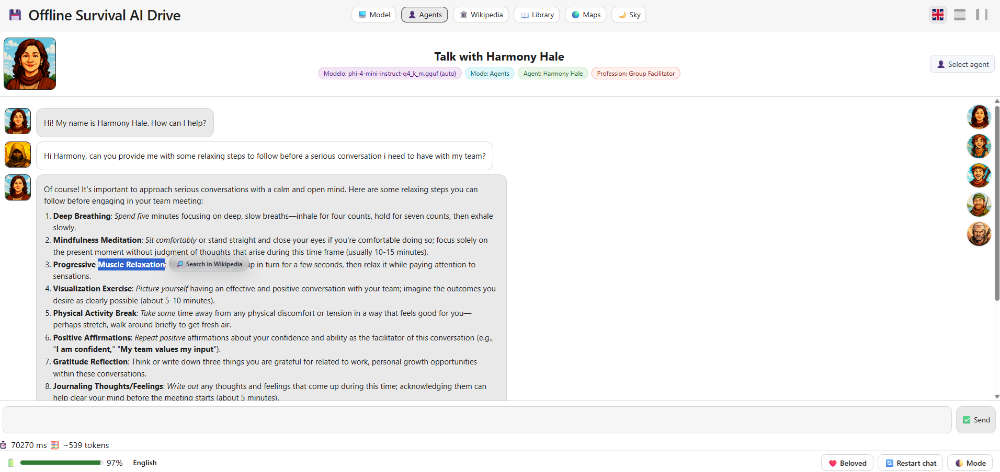
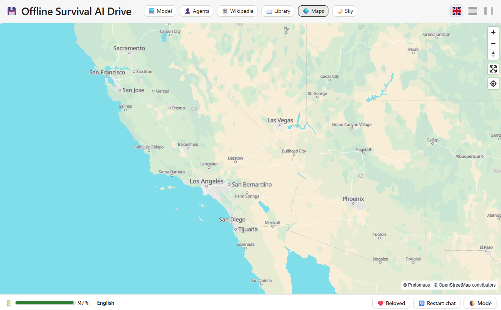
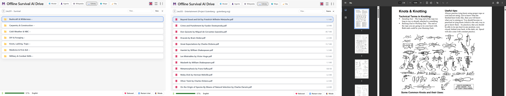
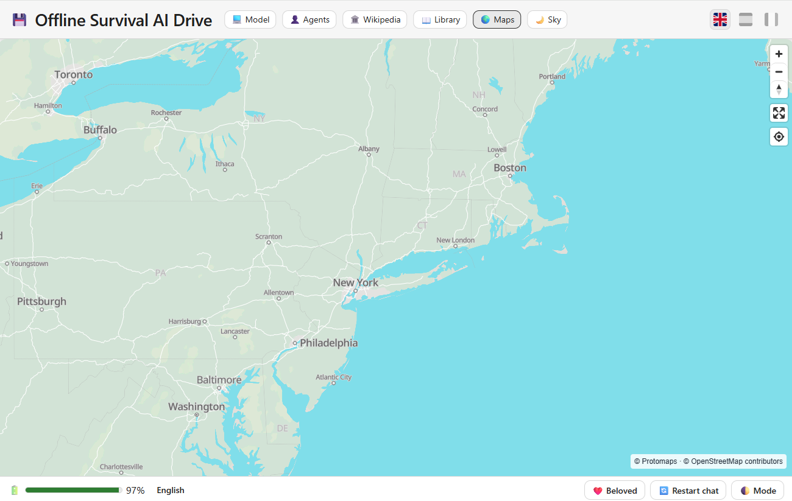
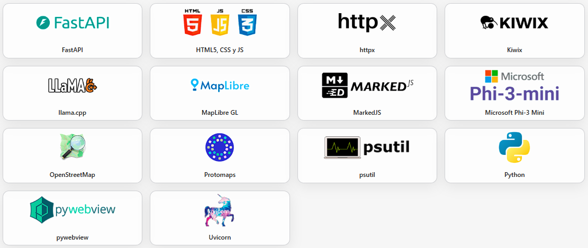

# 💾 Offline Survival AI Drive
<p align="center">
⚠️ The following instructions are intended for the windows x64 portable version.<br><br>🔥 If you want to have a look, project files are included in the github repository.<br>👥 For collaborations, please, contact us, this is our first github project, and all the help would be appreciated.
</p><br>
<p align="center">
  
</p>

### 🔹 Offline LLM & Agents & Wikipedia & Maps & Documents (EN,ES,FR)

**Survival AI** is a 100% **offline** desktop-style web app to chat with a **local LLM (GGUF)** or with **expert agents** (medical, biology, engineering, etc.). It also integrates **offline Wikipedia, Offline Maps and Survival Documentation**.
**No internet required.**

- AI model (Miscrosoft): **Phi-4 Mini 4K Instruct (Q4_K_M)**
- Maps: **Protomaps OpenStreetMaps** (planet.pmtiles)  
- Wikipedia: **kiwix-serve** with local **ZIM** files
<br>
<p align="center">
  
</p>

### ✨ Features

- **100% offline**: runs locally with GGUF models via `llama-cpp-python` (no cloud, no telemetry).
- **Two chat modes**: **🤖 Model** — direct chat with the selected LLM. **👥 Agents** — visual agent picker (medical, engineering, etc.).
- **Offline Worldwide Map**: built-in tab that works with **Protomaps and pmtiles** + **OpenStreetMaps** files.
- **Offline Wikipedia**: built-in tab that works with **Kiwix** + **ZIM** files; can auto-start `kiwix-serve`.
- **3 types of wikipedia available**: "maxi", "no-pic" & "mini".
- **Library Folders**: for **.pdf** files you want to store.
- **Multi-language UI**: EN / ES / FR (including localized agent categories).
- **Clean UI/UX**: light/dark theme toggle, battery indicator bar.
 
> This repository **does not ship any model or ZIM files or pmtiles files**. You’ll download them yourself (links and instructions provided below) or download the portable app with the files from our website.


---

# ✅ Requirements

This project is designed to run **fully offline** on a modest CPU-only machine. Below are the **technical requirements** for your workstation.

### Hardware (recommended)
- **CPU:** x86_64 with **AVX2** support (for good `llama-cpp-python` performance).
- **RAM:** 8 GB minimum (16 GB recommended for smoother multitasking or larger contexts).
- **Disk:** from 8 to 200 GB depending on the **GGUF** model(s) you keep plus **Wikipedia ZIM** files and **pmtiles** files.
- **GPU:** *Not required* (CPU-only).

### Operating Systems
- **Windows 10/11 x64**
- **macOS** (coming soon)
- **Linux** (coming soon)


---

# 📝 Instructions

#### The following instructions are intended for the Portable windows x64 version you can find in our website **https://offlineai.org** or in the following link: [Download Link](https://offlineai.org)

## 📦 Project Structure for needed files
Download the project zip file and extract in root **C:/** or in the **folder** you prefer on your desktop.

```
/SurvivalAI
│
├── SurvivalAI.exe
│
├── backend/
│ ├── main.py
│ ├── requirements.txt
│
├── docs/
│ ├── en/organize .pdf as you want.
│ ├── es/organize .pdf as you want.
│ └── fr/organize .pdf as you want.
│
│
├── frontend/
│ ├── index.html
│ ├── style.css
│ └── script.js
│
├── models/ # Put your .gguf files here (e.g., phi-4-mini-instruct-q4_k_m.gguf)
│
├── kiwix/
│ ├── kiwix-serve(.exe)
│ └── content/ # Put Wikipedia .zim files here (ES/EN/FR; maxi/nopic/mini)
│
├── agents.json
├── categories.json
├── supporters.json
├── README.md
└── LICENSE
```


---

# 🤖 Downloading the Model (Phi-4 Mini.GGUF)

**Licensing & responsibility**

- The file below is hosted by a third-party Hugging Face repo. You are responsible for ensuring the **license is compatible** with your intended use and for keeping any required **attributions**.

<p align="center">
Download page:<br>https://huggingface.co/matrixportalx/Phi-4-mini-instruct-Q4_K_M-GGUF
<br>
Download model link (.GGUF file - 2,49 GB):<br>https://huggingface.co/matrixportalx/Phi-4-mini-instruct-Q4_K_M-GGUF/blob/main/phi-4-mini-instruct-q4_k_m.gguf
<br>
</p>

👉 **Do not rename** Place the GGUF file in: ``./SurvivalAI/_internal/models/phi-4-mini-instruct-q4_k_m.gguf``.


---

# 📖 Downloading Wikipedia ZIM files

<p align="center">
  
</p>

**Download page (browse & pick, choose this link if you want to see all available zim files and download selecting the preferred one, or use the below links):**  
https://download.kiwix.org/zim/wikipedia/

### 🌐 Target filenames.
(candidates your backend expects, select toe option you prefer)

**Zim File Types**.<br>
**Which file do I need to select? the one you prefer ;)**.

-**all_maxi** --> All articles - Full Articles with Images.<br>
-**all_nopic** --> All articles - Full Articles without Images.<br>
-**all_mini** --> All articles - First section Articles without Images. 

⚠️⚠️⚠️ Be carefull before downloading huge files to your computer. ⚠️⚠️⚠️

**EN (7.042.731 articles):**
  - [wikipedia_en_all_maxi_2025-08.zim](https://download.kiwix.org/zim/wikipedia/wikipedia_en_all_maxi_2025-08.zim) - (116 GB)
  - [wikipedia_en_all_nopic_2025-08.zim](https://download.kiwix.org/zim/wikipedia/wikipedia_en_all_nopic_2025-08.zim) - (43 GB)
  - [wikipedia_en_all_mini_2025-06.zim](https://download.kiwix.org/zim/wikipedia/wikipedia_en_all_mini_2025-06.zim) - (14 GB)

**ES (2.052.431 articles):**
  - [wikipedia_es_all_maxi_2025-07.zim](https://download.kiwix.org/zim/wikipedia/wikipedia_es_all_maxi_2025-07.zim) - (38 GB)
  - [wikipedia_es_all_nopic_2025-08.zim](https://download.kiwix.org/zim/wikipedia/wikipedia_es_all_nopic_2025-08.zim) - (9 GB)
  - [wikipedia_es_all_mini_2025-08.zim](https://download.kiwix.org/zim/wikipedia/wikipedia_es_all_mini_2025-08.zim) - (3 GB)

**FR (2.693.000 articles):**
  - [wikipedia_fr_all_maxi_2025-06.zim](https://download.kiwix.org/zim/wikipedia/wikipedia_fr_all_maxi_2025-06.zim) - (54 GB)
  - [wikipedia_fr_all_nopic_2025-08.zim](https://download.kiwix.org/zim/wikipedia/wikipedia_fr_all_nopic_2025-08.zim) - (11 GB)
  - [wikipedia_fr_all_mini_2025-08.zim](https://download.kiwix.org/zim/wikipedia/wikipedia_fr_all_mini_2025-08.zim) - (4 GB)

👉 **Do not rename** the files after download. Put them under: `./SurvivalAI/_internal/kiwix/content/file_name.zim`

---

# 📚 Adding more to your library (pdf files)

**Our Recommendation - Project Gutemberg Resource:** is a volunteer-driven digital library that offers over 70,000 free eBooks, including many classics of world literature. All the books are in the public domain, which means they can be freely read, downloaded, and shared without cost. It is one of the oldest and largest online collections of free books, created to make cultural works accessible to everyone, everywhere.
https://www.gutenberg.org/

👉 Place your **.pdf** files in: `./SurvivalAI/_internal/docs/and the folders you want inside` **Organice yourself 🤪**.<br><br>

<p align="center">
  
</p>


---

# 🌍 Downloading the planet.pmtiles file

**Worldwide Maps**

- Download instructions.

<p align="center">
  
</p>

**Download page:**  
https://maps.protomaps.com/builds/

⚠️⚠️⚠️ Be carefull before downloading huge files to your computer. ⚠️⚠️⚠️

[**Download planet.pmtiles full layer link (.pmtiles file - 120 GB):**](https://demo-bucket.protomaps.com/v4.pmtiles)  

👉 Place the **planet.pmtiles** file in: `./SurvivalAI/_internal/frontend/assets/maps/planet.pmtiles` (**Rename it** to planet.pmtiles if needed).

---

# ❤️ Special thanks to:

**Thanks to all the developers behind these projects for making this possible. I would never have thought, until I met you, that the project I had in mind could be so easy thanks to you.**

<p align="center">
  
</p>
